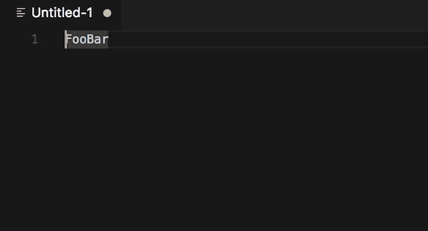

# String Convert for VSCode

String Convert : FooBar → foo_bar → fooBar → foo-bar → FooBar ...

## Use

To use these commands, press ⌘+shift+p and enter any of the commands above while text is selected in your editor.

mac: command+shift+p

windows: ctrl+shift+u

